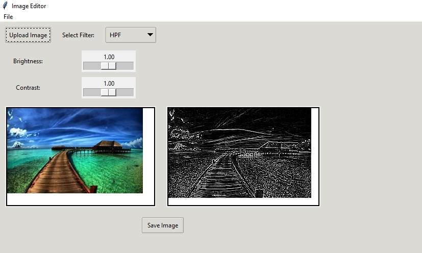

# Digital Image Processing Practical Project

This is a simple image editor application built using Tkinter and Python. It provides a user-friendly interface for loading images, applying various filters and image processing techniques, and saving the edited images.

## Features

- *Image Loading:* Load images in common formats such as JPEG, PNG, and GIF.
- *Filter Options:* Apply a variety of filters and image processing techniques, including High-pass filter (HPF), Low-pass filter (LPF), Mean filter, Median filter, Edge detection (Roberts, Prewitt, Sobel), Threshold Segmentation, Hough Circle Transform, and Morphological operations (Erosion, Dilation, Opening, Closing).
- *Brightness and Contrast Adjustment:* Fine-tune the brightness and contrast of images.
- *Save Edited Images:* Save the edited images in PNG format.

## Screenshots


## Usage

1. *Clone the Repository:*
   git clone [https://github.com/Eng-Ahmed-Radwan/Digital_Image_Processing_Practical_Project](https://github.com/Eng-Ahmed-Radwan)
2. *Install Dependencies:*
   ```bash
   pip install -r requirements.txt
3. **Run the Application:**
   ```bash
   python image_editor.py

4. *Using the Application:*
  - Click on the "Upload Image" button to load an image.
  - Choose a filter from the dropdown menu to apply it to the loaded image.
  - Adjust the brightness and contrast sliders as needed.
  - Click on "Save Image" to save the edited image.

## Contributing
  Contributions are welcome! Feel free to open issues or submit pull requests to improve the application.

## License

This project is licensed under the [MIT License](LICENSE).
